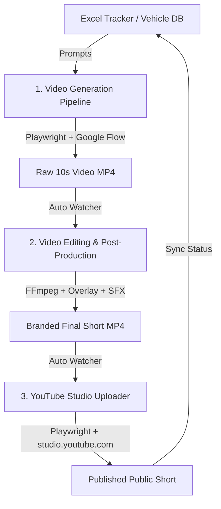

# YouTube Shorts End-to-End Automation Pipeline 🚀

An autonomous, multi-stage production suite for generating, editing, and uploading cinematic vertical YouTube Shorts (9:16) at scale.

---

## 🏗️ Architecture Overview

The system operates across three decoupled, synchronized pipelines:



1. **`youtube-automation/`**: Web automation engine driving Google Flow using Playwright. Navigates project canvases, configures 9:16 720p 10s render parameters, enters structured ASMR product unboxing prompts, approves generation credit proposals, and intercepts/downloads 720p video assets.
2. **`video-editor/`**: Automated post-production engine utilizing FFmpeg. Retimes videos to exact 10.0-second durations, overlays channel branding watermark at `(545, 1106)`, synchronizes intro SFX (0.0s) and outro transition audio (10.0s), and appends a 4.0-second call-to-action animation outro.
3. **`youtube-uploader/`**: Headless/headed YouTube Studio uploader using Playwright with persistent authentication profiles. Generates dynamic SEO titles, hashtags, and descriptions, injects media into Studio upload modals, sets "Not made for kids", polls upload progress to 100% completion verification, and publishes as Public Shorts.
4. **`auto_edit_upload_watcher.py`**: A unified daemon that watches for new raw generation outputs, runs batch editing with automatic original cleanup, synchronizes master Excel trackers, and triggers instant uploads.

---

## 🛠️ Tech Stack & Dependencies

* **Language**: Python 3.10+
* **Browser Automation**: [Playwright](https://playwright.dev/python/) with persistent browser contexts and Chrome channel integration
* **Video Processing**: [FFmpeg](https://ffmpeg.org/), `ffmpeg-python`, [OpenCV](https://opencv.org/) (`cv2`), [MoviePy](https://zulko.github.io/moviepy/)
* **Image Processing**: [Pillow](https://pillow.readthedocs.io/)
* **Data & Trackers**: [OpenPyXL](https://openpyxl.readthedocs.io/), [Pydantic](https://docs.pydantic.dev/)
* **CLI & Logging**: [Rich](https://rich.readthedocs.io/)

---

## 📁 Repository Structure

```text
yt-shorts-automation/
├── auto_edit_upload_watcher.py   # Unified autonomous watcher daemon
├── manage_status.py              # Spreadsheet status sync & validation
├── sync_100_cars_tracker.py      # 100 Popular Cars tracker synchronizer
├── requirements.txt              # Consolidated Python dependencies
├── README.md                     # Documentation
│
├── youtube-automation/           # Phase 1: AI Generation Pipeline
│   ├── app/                      # Browser controllers & generation loops
│   ├── config/                   # Pipeline and browser settings
│   ├── data/                     # Vehicle definitions & prompt templates
│   ├── run_main_loop.py          # Batch generation runner
│   └── switch_account.bat        # Google account switcher utility
│
├── video-editor/                 # Phase 2: Video Post-Production
│   ├── batch_editor.py           # FFmpeg video retiming, watermarking & audio mixing
│   └── assets/                   # Logos, intro audio, and outro animation
│
└── youtube-uploader/             # Phase 3: YouTube Studio Distribution
    ├── uploader.py               # Playwright automated YouTube Studio uploader
    ├── metadata_generator.py     # SEO titles, tags, and description generator
    ├── tracker.py                # Upload history tracking & JSON logging
    └── uploaded_videos.json      # Verified publication record
```

---

## ⚡ Quick Start

### 1. Prerequisites
* **Python 3.10 or higher** installed and added to PATH.
* **Google Chrome** installed.
* **FFmpeg** installed and accessible in PATH.

### 2. Installation
```powershell
git clone https://github.com/Manas8795/yt-shorts-automation.git
cd yt-shorts-automation
pip install -r requirements.txt
playwright install chromium
```

### 3. Setup Persistent Browser Authentication
Log in once to initialize persistent browser profiles:

* **Google Flow**: Run `python youtube-automation/login.py` and log into your Google account.
* **YouTube Studio**: Run `python youtube-uploader/login.py` and log into your YouTube channel account.

---

## 🚀 Running the Pipeline

### Autonomous Watcher (Recommended)
Run the auto watcher daemon to automatically edit, watermark, and upload videos as soon as they are generated:
```powershell
python auto_edit_upload_watcher.py
```

### Manual / Modular Execution

#### 1. Generate Raw Videos
```powershell
cd youtube-automation
python run_main_loop.py -n 10 -d 10 --100-cars
```

#### 2. Batch Edit & Watermark
```powershell
cd video-editor
python batch_editor.py --delete-original
```

#### 3. Upload to YouTube Studio
```powershell
cd youtube-uploader
python uploader.py --limit 10 --visibility PUBLIC
```

---

## 🔒 Security & Privacy Notice

* All browser profiles, local authentication cookies, session credentials, and downloaded video assets are strictly excluded via `.gitignore`.
* Never commit `browser_profile/` folders or API keys to version control.
